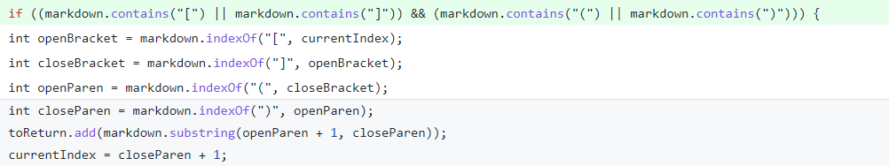
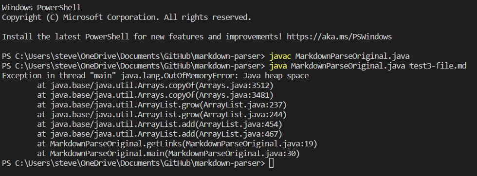
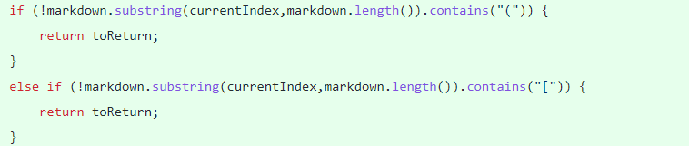
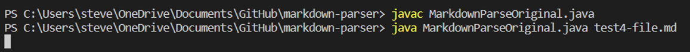
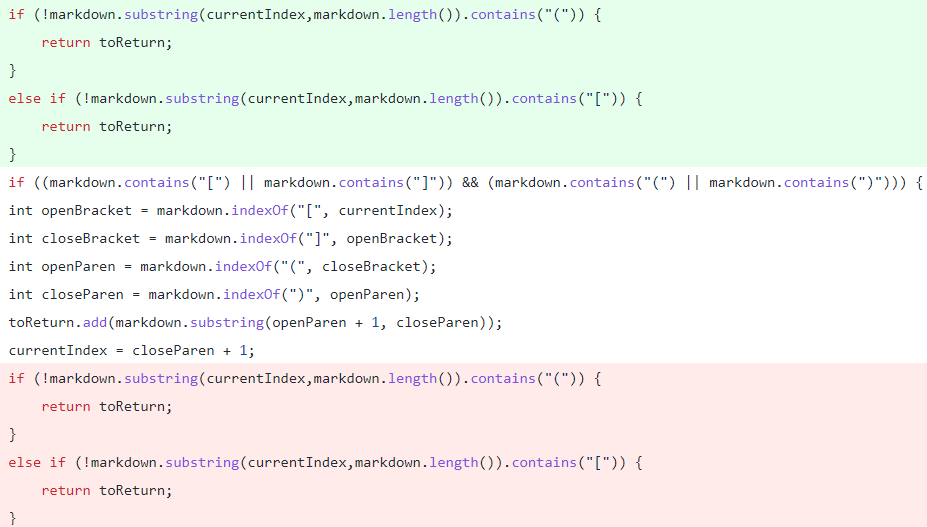
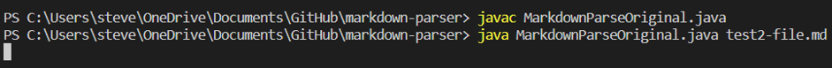

# Lab Report 2
## 1st Code Change

[Link to first failure-inducing input file](https://github.com/stevenngo3/markdown-parser/blob/main/test3-file.md)

Symptom: Heap error

The first symptom was a heap error due to an infinite loop from checking brackets or parentheses. With the code change, it allows the infinite loop to stop happening by finding an open bracket/paranthesis and a closed bracket/parenthesis.

## 2nd Code Change

[Link to second failure-inducing input file](https://github.com/stevenngo3/markdown-parser/blob/main/test4-file.md)

Symptom: Infinite loop

Before the code change, ArrayList would've been returned. With the code change, the code checks if string doesn't have an open bracket/parenthesis.

## 3rd Code Change

[Link to third failure-inducing input file](https://github.com/stevenngo3/markdown-parser/blob/main/test2-file.md)

Symptom: Infinite loop

In the third code change, what we did was change the position of the second code change. What this did was it prevents an infinite loop when it comes to empty brackets/parentheses.
