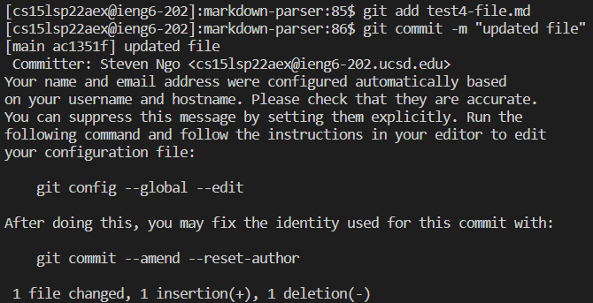
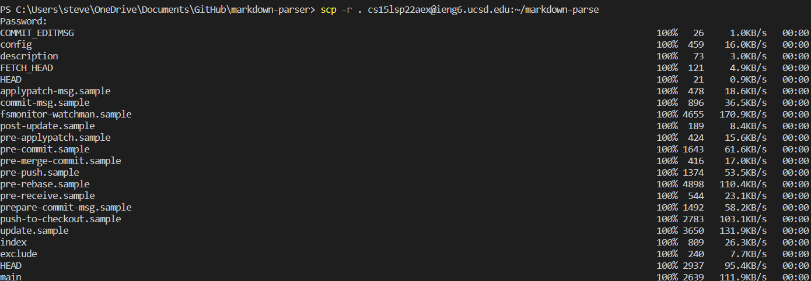
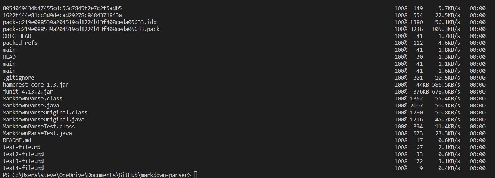
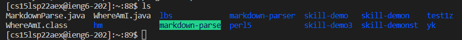

# Lab Report 3
## Streamlining ssh Configuration
### .ssh/config

For Windows, the notepad app was used for the config file.
### ssh Command

The ssh command is more efficient when signing into the remote server.
### scp Command

## Setup Github Access from ieng6
### Github public key

To upload the key into Github, `cat id_ed255519.pub` was ran in the terminal, and the result from the terminal was copy and pasted in.
### Private ieng6 key

### Running git commands

Commiting changes to Github using the terminal while being logged into the ieng6 account
### Link to resulting commit
[test4-file.md commit](https://github.com/stevenngo3/markdown-parser/commit/d3f114c29d8a0601973c430ba67cf9d9a296f7df)
## Copying whole directories with scp -r
### Screenshots of running scp -r

### Screenshot of markdown-parse dir in ieng6 account

