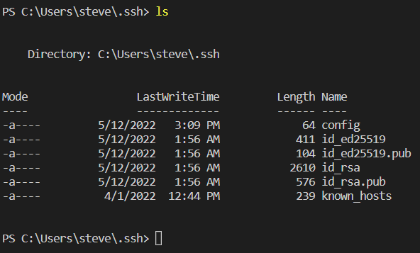

# Lab Report 3
## Streamlining ssh Configuration
### .ssh/config

For Windows, the notepad app was used for the config file.
### ssh Command

The ssh command is more efficient when signing into the remote server.
### scp Command

## Setup Github Access from ieng6
## Github public key

To upload the key into Github, `cat id_ed255519.pub` was ran in the terminal, and the result from the terminal was copy and pasted in.
## Private ieng6 key

## Running git commands
### Copying whole directories with scp -r

