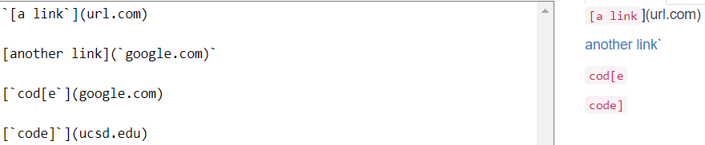
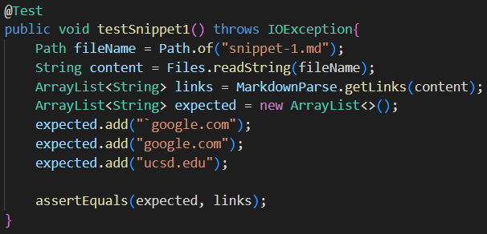
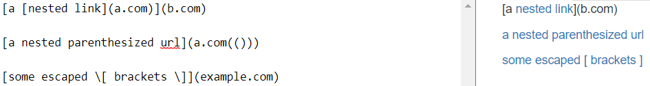
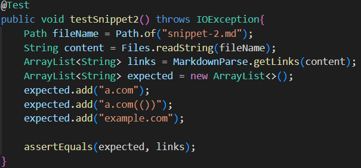
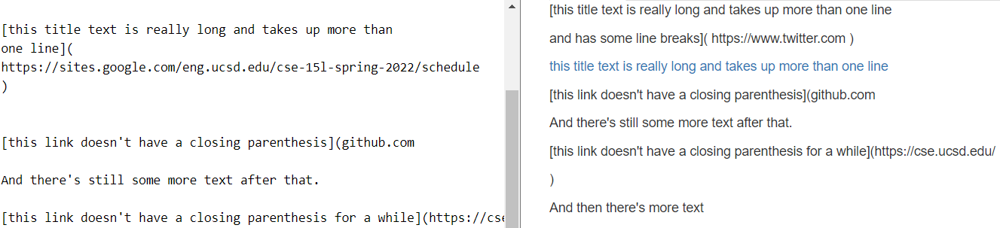
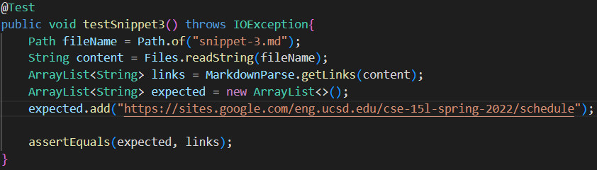

# Lab Report 4
[Link to my markdown-parse repository](https://github.com/stevenngo3/markdown-parser)

[Link to the markdown-parse repository I reviewed](https://github.com/ohuynh21/markdown-parser)  
## Test 1
### Expected output:

### Tester code:
 

Test failed

## Test 2
### Expected output:

### Tester code:

Test failed

## Test 3
### Expected output:

### Tester code:

Test failed

## Questions
### Do you think there is a small (<10 lines) code change that will make your program work for snippet 1 and all related cases that use inline code with backticks? If yes, describe the code change. If not, describe why it would be a more involved change. 
No, I don't think a small code change would make my program work for snippet 1. The whole logic would have to be changed for it to work as the code checks for a bracket and parses.

### Do you think there is a small (<10 lines) code change that will make your program work for snippet 2 and all related cases that nest parentheses, brackets, and escaped brackets? If yes, describe the code change. If not, describe why it would be a more involved change.
Yes, I think a small code change would make my program work for snippet 2. What could be added is a line of code, which is used as a right parse that checks the far right closing parenthesis.

### Do you think there is a small (<10 lines) code change that will make your program work for snippet 3 and all related cases that have newlines in brackets and parentheses? If yes, describe the code change. If not, describe why it would be a more involved change.
No, I don't think a small code change would make my program work for snippet 3. The whole code would have to be changed to look for the opened and closed parenthesis.
